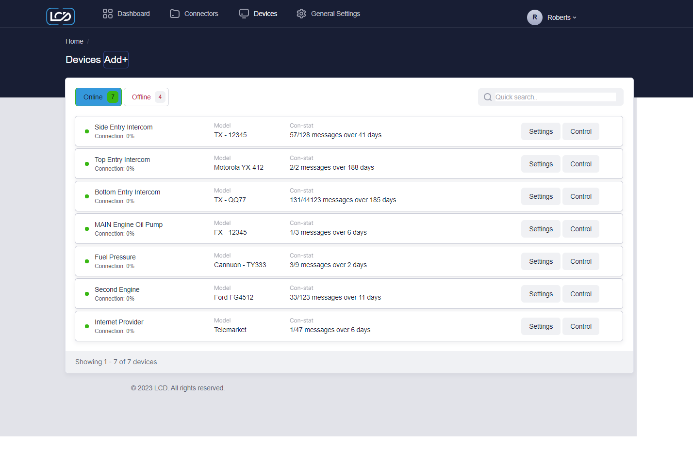
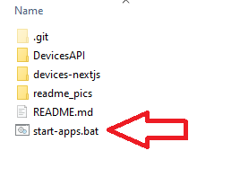

## Simple '.NET Core C# Web API' and 'ReactJS with Typescript using NextJS framework' application.

### Picture from project

http://localhost:3000 

### How to run project

### :exclamation::exclamation::exclamation: Download and install :exclamation::exclamation::exclamation:

Node Js Latest LTS Version 
https://nodejs.org/en/download/

.NET 6.0  
https://dotnet.microsoft.com/en-us/download

1. Clone or Download and extract all files and folders inside 'Devices'.

   - DevicesFullStack
     - devices-nextjs
     - DevicesAPI
     - readme_pics
     - README.md
     - start-apps.bat

2. Launch ASP.NET web API and NextJS project.

   - 2.1 If you are on Windows OS - Double click 'start-apps.bat' file in root directory.
   - 
   - If windows defender or antivirus says it is unsafe (you can open it in texteditor and look that is safe) you can still run it.
   - This should open 3 Command Prompts and default Web Browser.
     - It needs to install npm dependencies.
       - It needs to wait and run 'npm run dev' command.
       - It needs to run .NET backend.
       - You can run .bat file again if something gues wrong. Or run each one manually.
   - :exclamation: Wait until all is loaded and start using http://localhost:3000

   OR

   - 2.2 Launch using cmd or powershell.

     - 2.1.1 Go to Devices/DevicesAPI/DevicesAPI directory
     - 2.1.2 Open CMD (Command prompt) or powershell there and type 'dotnet run'

     OR

   - 2.3 Launch NextJS application.
     - 2.3.1 Go to 'Devices/devices-nextjs' open 'cmd' or powershell.
     - 2.3.2 Type 'npm install'
     - 2.3.3 Type 'npm run dev'

3. Go to Web Browser.

   - Go to https://localhost:5000/swagger/index.html for 'Swagger UI'
   - Go to http://localhost:3000 for NextJS frontend.

4. Use functionality.

   - devices
     - Inside http://localhost:3000.
     - By default or if no filters are entered it returns all online 'Device'.
     - In quick search field search by - 'name', 'model', 'messagesRecieved', 'messagesMaximum' or 'connectionStart'.
       - No matter what you enter it will start search.
         - Example, if there is model named 'TX - QQ77' and you search 'qq' it will find all devices that has 'qq' in name or model...

5. :exclamation: Use this step if data is lost or you want to add new or additional data.
   - To add more Devices you can use frontend (http://localhost:3000, and click 'Add+' button) or go to https://localhost:5000/swagger/index.html and use /api/devices/add endpoint.
   - You can use 'DB Browser (SQLite)' to open 'DevicesSQLite.db'
   - Click on 'Settings' button and Edit modal window will open.
     - You can edit 'Device' or delete it.

### Improvements

- Make it aslo mobile friendly.
- Align LCD logo to right.
- Align user name and logo to right.
- Move 'Add+' Device to Admin panel?
